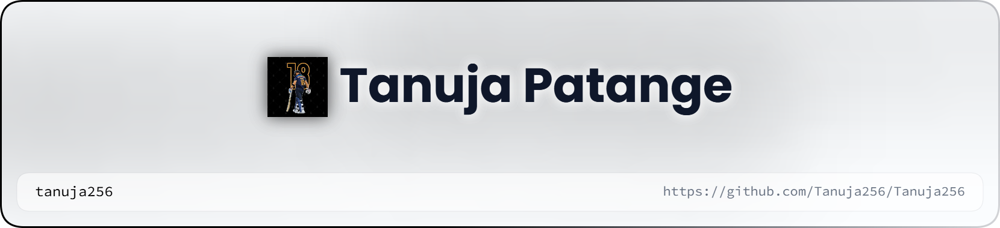

<!-- ========================================================= -->
<!--                    PROFILE README                         -->
<!-- ========================================================= -->

  <!-- Responsive Light/Dark Banner -->
<picture>
    <source media="(prefers-color-scheme: dark)" srcset="header-dark.png">
    
</picture>

 
  <!-- Typing Animation -->
  

    

  <!-- GitHub Badges -->
  
  
  

 

---

## 🌸 About Me

<table>
<tr>
<td width="65%" valign="top">

### Hey! I'm Tanuja 👩‍💻

I'm a **third-year CSE student** focused on full-stack development and DSA, passionate about building things that solve real problems.

- 🎓 **Education:** B.Tech, Computer Science Engineering (Data Science), VIT Pune — CGPA 8.72
- 💻 **Currently Learning:** Full-stack development (MERN)
- 🚀 **Working On:** [Studiora-X](https://github.com/Tanuja256/Studiora-X-tanuja) — a study productivity platform with focus timers, streaks, and analytics
- 🧩 **Also Practicing:** DSA
- 🎯 **Goal:** Get DSA + full-stack solid enough to clear interviews, not just pass courses
- 💡 **Interested In:** DSA, full-stack dev, hackathons, graphic design
- ⚡ **Fun Fact:** Drawing was my first love before code was

I enjoy turning ideas into projects, solving problems through code, and learning something new every day.

> **"Build. Break. Learn. Repeat."** ✨

 

</td>

<td width="35%" align="center" valign="middle">

  

</td>
</tr>
</table>

---

## 🛠️ Tech Stack

### 💻 Languages

  

### 🌐 Web & App Development

  

### 🗄️ Databases, Auth & Tools

---

## 🚀 Featured Projects

 

---

## 📊 GitHub Analytics

  

---

## 📈 Contribution Activity

---

## 🐍 Contribution Snake

<!-- GitHub Action:
Create .github/workflows/snake.yml to automatically generate the contribution snake.
-->

---

## 🏆 GitHub Achievements

---

## 💬 Let's Connect

  

---

## ✨ A Little More About Me

| 🌸 | Learn by building, not by watching |
|:---:|:---|
| 🎯 | **Current Focus:** Building Studiora-X while grinding DSA on the side |
| 💻 | **Favorite Stack:** MERN (React, Node, Express, MongoDB) |
| 🤝 | **Looking to Collaborate On:** Full-stack/MERN projects, hackathon teams, DSA accountability partners |
| 📚 | **Learning Philosophy:** Build first, understand deeply, fix what breaks |

---

### 💗 Thanks for visiting my profile!

